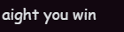

# So, what happened

Well, I was talking to one of the researchers and they said it took 2 hours to run a certain section of the program and I said I can do it under a minute so heres that

Also somehow I couldn't get the exact original results but the ratio is close enough so I guess its fine

## More explanation

the state is stored in a binary format in an integer

due to how the original paper works, GATA4 is the **least** significant bit, but binaries are printed **backwards**

```c
// internal
int state = 0b10000000011;
//            ^--------++ CTNNB1
//                     ^+ NR5A1
//                      ^ GATA4

// printed
// 1100000001

// GENE 0 is GATA4, also appears first on the binary table
```

# Hours wasted here: 20



At least I won

## How to run

Prepare precomputed binary file

```sh
$ python preprocess_csv.py
```

Run the program (edit some macros as needed)

```less
gcc -Wall -fdiagnostics-color=always main.c -O3 && time sudo nice -n -20 ./a.out
Total lines: 895029
Thread   0:       0 ~  55939
Thread   1:   55939 ~ 111878
Thread   2:  111878 ~ 167817
Thread   3:  167817 ~ 223756
Thread   4:  223756 ~ 279695
Thread   6:  335634 ~ 391573
Thread   5:  279695 ~ 335634
Thread   7:  391573 ~ 447512
Thread   8:  447512 ~ 503451
Thread   9:  503451 ~ 559390
Thread  10:  559390 ~ 615329
Thread  11:  615329 ~ 671268
Thread  12:  671268 ~ 727207
Thread  13:  727207 ~ 783146
Thread  14:  783146 ~ 839085
Thread  15:  839085 ~ 895029
Thread   0 done
Thread   1 done
Thread   2 done
Thread   4 done
Thread   5 done
Thread   3 done
Thread   9 done
Thread   6 done
Thread  10 done
Thread   8 done
Thread   7 done
Thread  15 done
Thread  13 done
Thread  14 done
Thread  11 done
Thread  12 done
  Attractor   0:  53329046 (5.82%)
    State: 0000000000
  Attractor 251: 514512013 (56.18%)
    State: 1101111100
  Attractor 773: 348027806 (38.00%)
    State: 1010000011
Cyclic: 640831 (0.07%)
Total: 916509696
done

real    0m5.306s
user    0m0.001s
sys     0m0.006s
```
